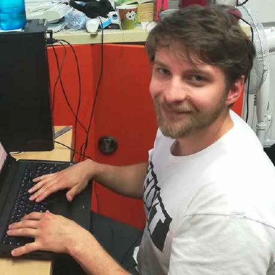
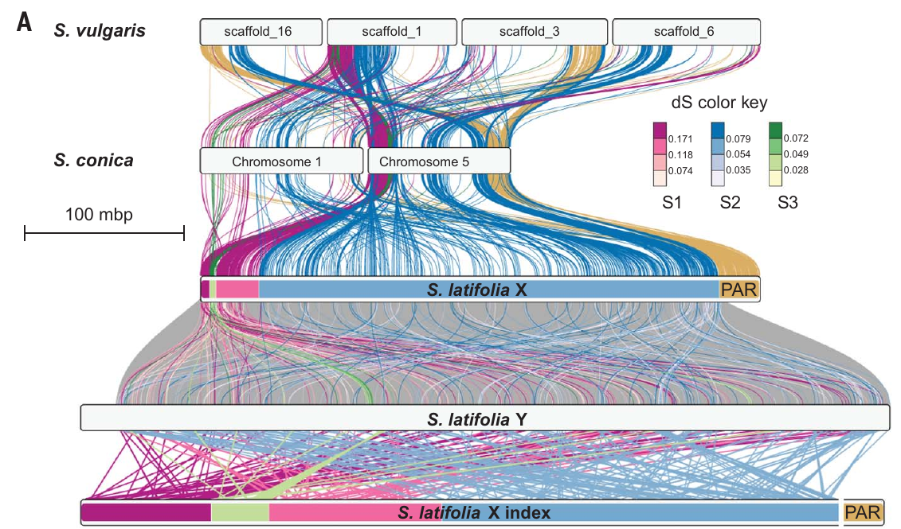
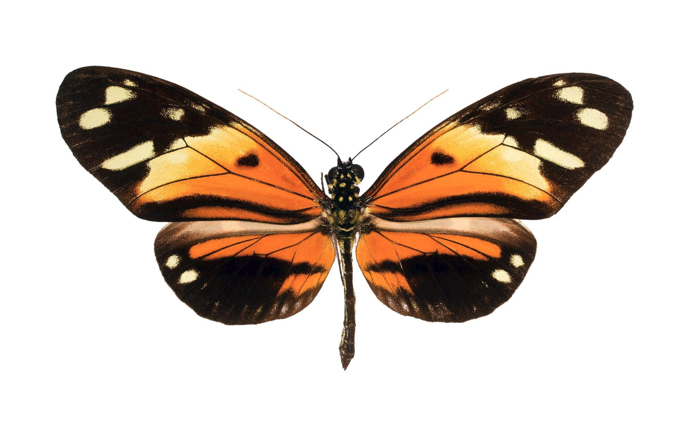
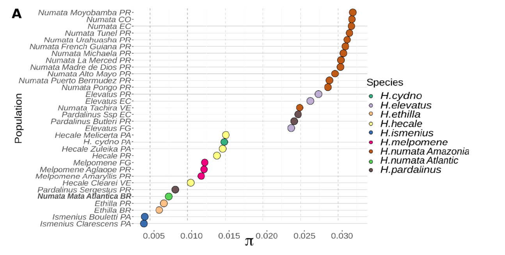
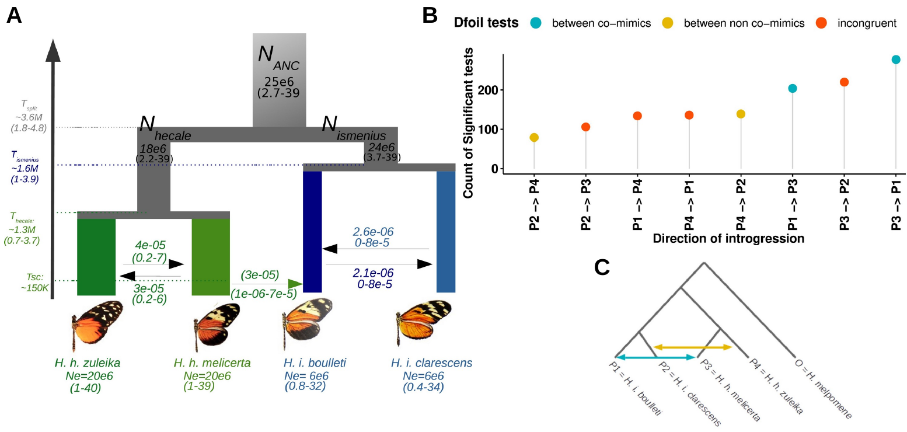
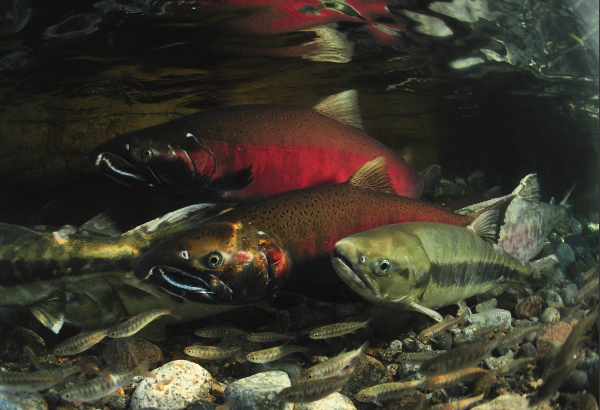
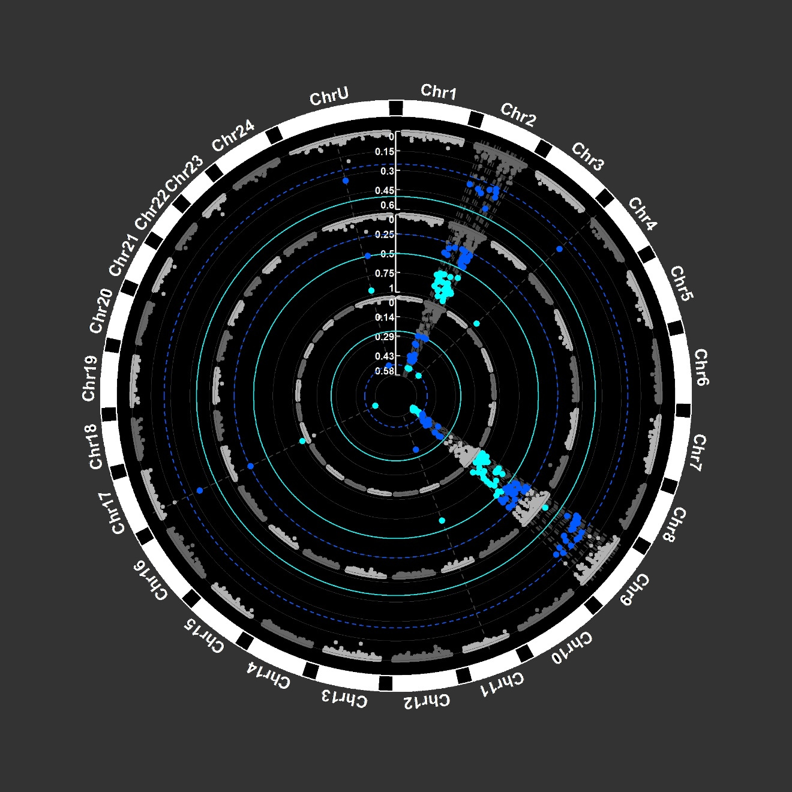
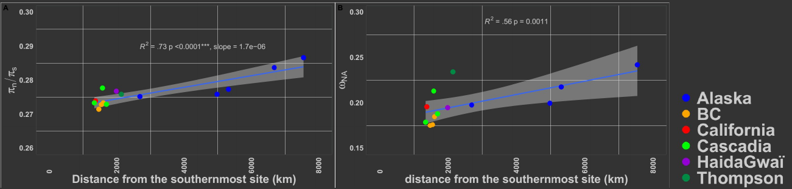
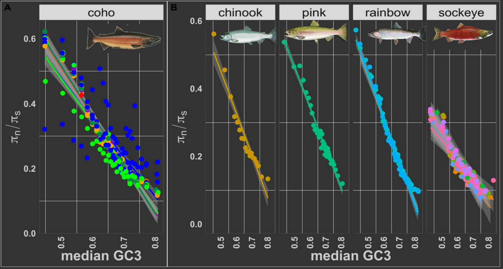

# Quentin Rougemont
[About](#about) · [My work](#my-work) · [Publications](#publications) · [Teaching](#teaching) · [Talks and posters](#talks-and-posters) · [Contact](#contact) · [Scripts and Pipelines](#Scripts and Pipelines)

   
   
   
    
    

## About

Hello,
My name is Quentin Rougemont, and I am a postdoctoral researcher in population genomics. I use the latest methodological advancements in my field to address the following questions: 
 

    **1. How do demography, selection, and recombination interact to drive processes of speciation and local adaptation? ** 

    **2. How do sex chromosomes evolve and persist across living organisms? ** 
 

I explore these questions across a wide range of organisms, from fungi and fish to plants and birds, encompassing diverse population sizes and varying degrees of gene flow. To do this, I employ an interdisciplinary approach that requires a solid understanding of fundamental concepts in evolutionary biology. 

I combine modeling with an empirical approach, leveraging population sequencing, which has enabled me to develop advanced skills in bioinformatics. 

In an attempt to increase research reproducibility I develop simple workflows for genome assembly, graph analyses, genome annotation, SNP calling, and demographic modelling using ABC and a bit of machine learning. 

**Keywords: Evolutionary biology, Speciation, Local adaptation, sex chromosome, genome assembly, genome annotation, GWAS-GEA.**

I am currently based at Institute for the Diversity, Ecology and Evolution of the Living World of the Université Paris Saclay ([IDEEV](https://www.ideev.universite-paris-saclay.fr/en/)). 

    
   

## News 

**The Silene latifolia genome and its giant Y chromosome** just published in [Science!](https://www.science.org/doi/10.1126/science.adj7430)

**abstract:** 
In many species with sex chromosomes, the Y is a tiny chromosome. However, the dioecious plant Silene latifolia has a giant ~550-megabase Y chromosome, which has remained unsequenced so far. We used a long- and short-read hybrid approach to obtain a high-quality male genome. Comparative analysis of the sex chromosomes with their homologs in outgroups showed that the Y is highly rearranged and degenerated. Recombination suppression between X and Y extended in several steps and triggered a massive accumulation of repeats on the Y as well as in the nonrecombining pericentromeric region of the X, leading to giant sex chromosomes. Using sex phenotype mutants, we identified candidate sex-determining genes on the Y in locations consistent with their favoring recombination suppression events 11 and 5 million years ago

see also New York time coverage [here](https://www.nytimes.com/2025/02/06/science/giant-y-chromosome-flower.html?smid=nytcore-ios-share&referringSource=articleShare)

as well as an article in french by the CNRS [here](https://www.inee.cnrs.fr/fr/cnrsinfo/le-sequencage-du-genome-de-silene-latifolia-eclaire-le-determinisme-du-sexe-chez-les)

**Figure teaser:**

**Figure teaser:** snapshot of figure 2 showing syntenic relationships between S. latifolia gametologs and autosomal genes in S. conica and S. vulgaris.Links between homologous chromosomal blocks in the outgroups and S. latifolia X are colored by evolutionary strata. Links between S. latifolia X and Y are colored by synonymous divergence bins (inset). Synteny between S. latifolia Y coordinates and S. latifolia X gene rank is shown at the bottom. The S. latifolia X chromosome tracks are colored by median synonymous divergence of the strata. The PAR region on S. latifolia Y, not shown, is placed to the right of the chromosome track.

  

## My work  

###  Ongoing work 
I am currently working on the evolution of sex chromosome in *Microbotryum* species my goal is to understand the cause of recombination suppression around sex and mating type chromosome in particular in cases were support for the classical hypothesism of sexual antagonism is low or inexistant.

To this aim I performed whole genome sequencing and annotation of several genome of multiple species of *Microbotryum.*

I quantify rate of genes loss and gains accross dozens of species of Microbotryum to links the rate of loss with the rate of recombination suppression. 

I also use pangenome graph approaches to quantify the landscape of structural variation in these species

I work in Tatiana Giraud's lab ([Evolutionary Genetics and Ecology team](https://www.ideev.universite-paris-saclay.fr/en/equipes/ese-gee/)).

### Past work 

### work in Mathieu Joron's Lab at [CEFE CNRS](https://joron.cefe.cnrs.fr/contact/)

### Heliconius numata demography:
 
During my postdoc in Mathieu's lab, I worked on the population genomics' of **Heliconius numata**. In particular, I was interested in understanding the consequences of the mating system on the species demography. In particular we were interested at testing wether balancing selection (at an inversion supergene) could alter the mating system of a species and have consequences at the genome-wide level on patterns of diversity.   
For instance, we show using empirical genomics that Heliconius numata carrying an inversion supergene involve in disasortative mating and heterozygote advantage display higher genetic diversity (and Ne) than any other heliconius species. This patern was consistent when comparing to Heliconius numata from Brazil devoid of the inversion-supergene.  
Using forward simulation we tested the hypothesis that balancing selection and disassortative mating increased genetic diversity in populations harbouring a supergene, although the magnitude of effect was small.

**Figure:**  *Variation in pi in several Heliconius populations, showing higher genetic diversity in H. numata populations from the Amazon than other taxa. Population names indicates their origin (PR=Peru, CO = Columbia, EC = Ecuador, FG = French Guiana, BR = Brazil (atlantic), VE = Venezuela, PA = Panama. The H. numata population with a lowest diversity is the one from the Atlantic forest (Brazil)*  

 
**associated paper:** 

* MÁ Rodríguez de Cara\*, P Jay\*, Q. Rougemont\*, M Chouteau, A Whibley, B, F Piron-Prunier, R Rogner Ramos, AVL Freitas, C Salazar, K Lucas Silva-Brandão, T Texeira Torres, M Joron (2023) Supergene formation is associated with a major shift in genome-wide patterns of diversity in a butterfly. Peer-Community Journal (10.24072/pcjournal.298). [manuscript](https://github.com/QuentinRougemont/quentinrougemont.github.io/blob/main/doc/27_DeCara_Jay_Rougemont_2023_pcjournal_298.pdf)  
 

## Speciation work on heliconius :  

I also studied the speciation process at the far end of the speciation continuum in a set of closely related species, *Heliconius hecale* and *Helionius ismenius* two strongly divergent species displaying co-mimics and non-comimics ecotypes.

Using a [four-populations ABC framework](https://github.com/QuentinRougemont/ABC_4pop) (extension of our [2pop models](https://github.com/QuentinRougemont/abc_inferences)) we revealed ongoing gene flow (Secondary Contact) between sympatric co-mimic (sub)-species of *H. hecale melicerta* and  *H. ismenius boulleti* whereas their non-comimimcs counterpart (H. hecale zuleika vs H. ismenius clarescens) do not seem to exchange gene anymore despite being in sympatry. 

 

**Figure:** **A.** Most likely scenario of divergence inferred from ABC and ABC-RF. The most likely model was obtained through both ABC and ABC-RF. Parameters were estimated with ABC. Arrows display migration rate. The arrow between species displays possible migration (inferred with ABC-RF only) between the comimics. Split time estimated in years assuming four generations per year. All models included the effect of selection at linked sites and of barriers to gene flow. Values in brackets displayed 95% posterior credible intervals. 
**B.** Number of significant DFOIL tests between each possible direction. **C.** Topology tested in the DFOIL analysis. Here, we use the term “incongruent” to refer to situations where the intergroup gene flow is between a comimic and a non-comimic species, which does not allow testing our hypotheses.

**associated paper:**
* Q Rougemont\*, B Huber\*, S Martin, A Whibley, C Estrada, D Solano, R Orpet, W.O McMillan, B Frérot, M Joron (2023) Subtle introgression footprints at the end of the speciation continuum in a clade of Heliconius butterflies. Molecular Biology and Evolution  https://doi.org/10.1093/molbev/msad166 
[manuscript](https://github.com/QuentinRougemont/quentinrougemont.github.io/blob/main/doc/28_Rougemont_et_al2023MBE_Heliconius.pdf)

  

### work in Louis Bernatchez's Lab at [Université Laval](http://www2.bio.ulaval.ca/louisbernatchez/presentation_fr.htm), and during my phd:

    <em> Coho salmon (Credit: Paul Vecsei) </em>

During my postdoc in Louis'lab as well as during my phd, I focussed mostly in the processes of **divergence** and **speciation** within populations. 

During my Ph.D., I was able to combine experimental approaches, population genetics (microsatellite markers), genomics (RADseq), and demographic modeling to better understand the divergence process in parasitic and non-parasitic lamprey ecotypes in Europe.

A unique characteristic of some lamprey and fish populations is their colonization of environments with varying connectivity, ranging from no connectivity in lakes, moderate connectivity in rivers, and very high connectivity in the sea. This variation creates a continuum, where isolated populations experience strong differentiation and genetic drift, little gene flow and display small effective population sizes. 
At the other extreme, populations in highly connected environments exhibit large amount of gene flow and effective population size to maintain nearly zero genetic differentiation across very large geographic scales or even the entire species' range (e.g., eel). This particular context offers the opportunity to address fascinating evolutionary questions about the roles of local selection, demography, and the functional architecture of genomes (e.g., mutation and recombination rates) in shaping genome composition and divergence in these populations.

In isolated lake or river populations, genetic drift promotes the fixation of neutral or moderately deleterious alleles theoretically affecting the entire genome, while selection is expected to act on localized regions in the genome. However, the strong population structure in aquatic environments can make identifying selection challenging. Conversely, in marine populations, the effect of drift is minimal, and theory predicts a low number of adaptive polymorphisms, or that these have a transient contribution to local adaptation, making them similarly difficult to detect. Along this continuum, many factors can confound the effects of local selection, such as background selection, global selective sweeps in structured populations, or the increased frequency of alleles in expanding populations (allele surfing).

In all cases, the genomes of contemporary populations have been shaped by complex demographic histories, which also leave their signatures along the genomes. Finally, the internal functional architecture of genomes, such as variations in the local recombination rate, can generate patterns of differentiation similar to the effects of local adaptation, particularly in regions where recombination is low or absent. 

During this postdoc and my phd I : 
* used and develloped methods to infer the demographic history of populations and deduce the expected neutral differentiation patterns under each demographic model to identify signatures of selection in species living in environments with variable connectivity. 

* Perform Genetic-Environment Association analyes (GEA) which is similar to GWAS approaches to infer putative footprint of local adaptation in various species.

        example paper: 
 
    * Q Rougemont, A Xuereb, X Dallaire, JS Moore, E Normandeau, EB Rondeau, RE Withler, DM Van Doornik, PA Crane, KA Naish, JC Garza, TD Beacham, BF Koop, L Bernatchez (2022) Long-distance migration is a major factor driving local adaptation at continental scale in Coho salmon Molecular Ecology https://doi.org/10.1111/mec.16339.  

	    *  see perspective: https://doi.org/10.1111/mec.16792 [manuscript](https://github.com/QuentinRougemont/quentinrougemont.github.io/blob/main/doc/22_Rougemont_Molecular_Ecology_2022.pdf)

    * H. Cayuela\*, Q Rougemont\*,  M Laporte, C Mérot, E Normandeau, S Jentoft, P Sirois, M. Castonguay, T Jansen, K Praebel, M Clément, L Bernatchez (2020). Shared ancestral polymorphisms and chromosomal rearrangements as potential drivers of local adaptation in a marine fish. Molecular Ecology. https://doi.org/10.1111/mec.15499  (\*: Co-first authorship). [here](https://github.com/QuentinRougemont/quentinrougemont.github.io/blob/main/doc/17_CayuelaRougemont_et_al2020_Shared ancestral polymorphisms and chromosomal rearrangements as potential drivers of.pdf)

**circos plots showing the distribution of outliers in Capelan Fst values are displayed. High Fst values are observed on two chromosomes in an ocean of low differentiation**

* Used molecular approach to study the genetic load of expanding populations, in particular the process of **allele surfing**

        example paper:
 
    * Q Rougemont, T Leroy, EB Rondeau, BF Koop, L Bernatchez (2023) Allele surfing causes maladaptation in a Pacific salmon of conservation concern. Plos Genetics  DOI: 10.1371/journal.pgen.1010918. [manuscript](https://github.com/QuentinRougemont/quentinrougemont.github.io/blob/main/doc/29_Rougemont_et_al_2023_PlosGenetics.pdf)

**Linear increase in the deleterious load in Coho salmon** **Left panel:** increase in the $\frac{\pi~N~}{\pi~S~}$ ratio (proxy for the load) as a function of the distance from the most likely ancestral refugia. Right panel: inceased in the rate of non-adaptive amino-acid subsitution relative to neutral divergence ($\omega~NA~$). Similar correlations were observed when using more robust proxies for the load.

*recombination explains the load in salmon* the levels of GC3 in the genome (used as a proxy for the rate of recombination) is strongly correlated with the $\pi~N~/$\pi~S~ ratio, used here as a proxy for the load.

 

## Publications

below is a set of **selected publications** click here to get the full list  

note: the "\*" indicates co-first authorship

* C Moraga\*, C Branco\*, Q Rougemont\*, P Veltsos, P Jedlička, [….], D Charlesworth, T Giraud, A. Bendahmane, A. Di Genova, A. Madoui, R Hobza, G.A.B. Marais The Silene latifolia genome and its giant Y chromosome. bioRxiv 2023.09.21.558754; doi: https://doi.org/10.1101/2023.09.21.558754. In review. [manuscript](https://github.com/QuentinRougemont/quentinrougemont.github.io/blob/main/doc/34_Moraga_Branco_Rougemont_et_al-2023-InReview.pdf).

* Q Rougemont, T Leroy, EB Rondeau, BF Koop, L Bernatchez (2023) Allele surfing causes maladaptation in a Pacific salmon of conservation concern. Plos Genetics  DOI: 10.1371/journal.pgen.1010918. [manuscript](https://github.com/QuentinRougemont/quentinrougemont.github.io/blob/main/doc/29_Rougemont_et_al_2023_PlosGenetics.pdf)

* Y Dorant, M Laporte, Q Rougemont, H Cayuela, R Rochette, L Bernatchez (2022). Landscape genomics of the American lobster (Homarus americanus). Molecular Ecology. https://doi.org/10.1111/mec.16653 [manuscript](https://github.com/QuentinRougemont/quentinrougemont.github.io/blob/main/doc/23_Dorant_et_al2022MolEcol_Landscape genomics of the American lobster Homarus americanus.pdf)

* Q Rougemont, B Huber, S Martin, A Whibley, C Estrada, D Solano, R Orpet, W.O McMillan, B Frérot, M Joron (2023) Subtle introgression footprints at the end of the speciation continuum in a clade of Heliconius butterflies. Molecular Biology and Evolution  https://doi.org/10.1093/molbev/msad166 
[manuscript](https://github.com/QuentinRougemont/quentinrougemont.github.io/blob/main/doc/28_Rougemont_et_al2023MBE_Heliconius.pdf)

* MÁ Rodríguez de Cara*, P Jay*, Q. Rougemont*, M Chouteau, A Whibley, B, F Piron-Prunier, R Rogner Ramos, AVL Freitas, C Salazar, K Lucas Silva-Brandão, T Texeira Torres, M Joron (2023) Supergene formation is associated with a major shift in genome-wide patterns of diversity in a butterfly. Peer-Community Journal (10.24072/pcjournal.298). [manuscript](https://github.com/QuentinRougemont/quentinrougemont.github.io/blob/main/doc/27_DeCara_Jay_Rougemont_2023_pcjournal_298.pdf)

* Q Rougemont, A Xuereb, X Dallaire, JS Moore, E Normandeau, EB Rondeau, RE Withler, DM Van Doornik, PA Crane, KA Naish, JC Garza, TD Beacham, BF Koop, L Bernatchez (2022) Long-distance migration is a major factor driving local adaptation at continental scale in Coho salmon Molecular Ecology https://doi.org/10.1111/mec.16339.
	*  voir perspective: https://doi.org/10.1111/mec.16792 [manuscript](https://github.com/QuentinRougemont/quentinrougemont.github.io/blob/main/doc/22_Rougemont_Molecular_Ecology_2022.pdf)

* Q  Rougemont, J-S Moore, T. Leroy, E. Normandeau, E.B. Rondeau, R.E. Withler, D.M.Van Doornik, P.A. Crane, K.A. Naish, J.C Garza, T.D. Beacham, B.F. Koop, L Bernatchez (2020) Demographic history shaped geographical patterns of deleterious mutation load in a broadly distributed Pacific salmon. PLOS Genetics. https://doi.org/10.1371/journal.pgen.1008348 [manuscript](https://github.com/QuentinRougemont/quentinrougemont.github.io/blob/main/doc/19_Rougemont_et_al2020PlosGen.pdf)

* Q Rougemont*, H Cayuela*, M Laporte, C Mérot, E Normandeau, S Jentoft, P Sirois, M. Castonguay, T Jansen, K Praebel, M Clément, L Bernatchez (2020). Shared ancestral polymorphisms and chromosomal rearrangements as potential drivers of local adaptation in a marine fish. Molecular Ecology. https://doi.org/10.1111/mec.15499  (*: Co-first authorship). [manuscript](https://github.com/QuentinRougemont/quentinrougemont.github.io/blob/main/doc/17_CayuelaRougemont_et_al2020_Shared ancestral polymorphisms and chromosomal rearrangements as potential drivers of.pdf)

* C Perrier, Q Rougemont, Charmentier A (2020) Demographic history and genomics of local adaptation in blue tits. Evolutionary Applications. https://doi.org/10.1111/eva.13035 [manuscript](https://github.com/QuentinRougemont/quentinrougemont.github.io/blob/main/doc/16_PerrierRougemontCharmentier2020_Demographic history and genomics of local adaptation in blue tit populations.pdf)
 

## Teaching 
### Demographic Inference course
> in 2023 I was instructor of the Demographic Inference course online by [physalia](https://www.physalia-courses.org/courses-workshops/demoinference/)

## Scripts and Pipelines

> I am  trying to share some of my code and worflows as much as possible for the sake of reproducibility and to help students.

> all this code can be find [here](https://github.com/quentinRougemont/)

## Talks and posters 

25 – Conférence Jacques Monod – 2023 –  Roscoff – Oral – Co-author (Speaker : G. Marais): Silene genome assembly and sex chromosome 

24 – Conférence Jacques Monod – 2023 – Roscoff – Poster – Co-author (Speaker : E. Lucotte): HD/PR in microbotryum 

23 – Conférence Jacques Monod – 2023 – Rosocff – Poster – (Speaker : L. Boyer): [link](https://github.com/QuentinRougemont/quentinrougemont.github.io/blob/main/doc/)
 
22 – Conférence Réseau International Silène – 2023 – Online –  Oral : The Silene latifolia genome and its giant Y chromosome 
 
21 - AIEM  –  2023 – France – Oral (Speaker : M. Joron) : Sublte introgression in a clade of strongly isolated Heliconius species 

20 - AFS – 2022 –  Spokane (Washington) – Oral – Co-author (Speaker : A. Xuereb) : Conservation Units in Coho salmon 

19 - CCFR – 2021 – Online – Oral – Co-author (Speaker : A. Xuereb) : Conservation Units in Coho salmon 

18 - ICISB –  2019 – Édimbourg – Oral:Divergent history, linked selection and deleterious mutations in Coho salmon across its native range 

17 - RAQ  –  2022 – Québec – Oral – Co-author (Speaker : A. Xuereb) : Conservation Units in Coho salmon
 
16 - RAQ  –  2019 – Québec – Oral: Reconstruire l’histoire démographique et sélective du saumon coho sur son aire de distribution

15 - RAQ  –  2019 – Québec – Oral – Co-author (Speaker : Y. Dorant)

14 - RAQ  –  2018 – Québec – Oral

13 - RAQ  –  2017 – Québec – Oral

12 - Joint ESEB-Evolution Congress – 2018 – Montpellier – Poster: Divergent history, linked selection and deleterious mutations in Coho salmon across its native range [link](https://github.com/QuentinRougemont/quentinrougemont.github.io/blob/main/doc/)

11 - Evolution – 2017 – Portland (Maine) – Oral: Inferring the demographic history of Atlantic salmon through ABC

10 - Conférence Jacques Monod – 2016 – Poster: Genome-wide divergence history of Atlantic salmon Salmo salar across its native range [link](https://github.com/QuentinRougemont/quentinrougemont.github.io/blob/main/doc/)

9 - Lobster Conference – 2017 – Portland (Oregon) – Oral

8 - Lobster Conference – 2017 – Portland (Oregon) – Oral – Co-author (Speaker : Y. Dorant)

7 - Lobster Conference – 2017 – Portland (Oregon) – Oral – Co-author (Speaker : L. Benestan)

6 - FSBI  –  2016 – Bangor – Oral  : Inferring the demographic history underlying parallel genomic divergence among pairs of parasitic and non parasitic lampreys ecotypes

5 -  FSBI  –  2016 – Bangor – Oral – Co-1er author (Speaker : G. Evanno): Fragmentation and genetic diversity of European lampreys 

4 -  ESEB –  2015 –  Lausanne – Poster: The demographic history of European lampreys 

3 -  SMBE/SMBEBA – 2015 – Montpellier (St. Martin de Londres) – Poster: Modelling divergence in European lampreys 

2 -  AFS – Québec –  2014 – Oral: Speciation in European lampreys 

1 -  ESEB –  2013 – Portugal – Oral: Ecological speciation in European lampreys

## Contact 
:email: quentinrougemont [at] orange [dot] fr 

---

Last update: 2025/02/18
