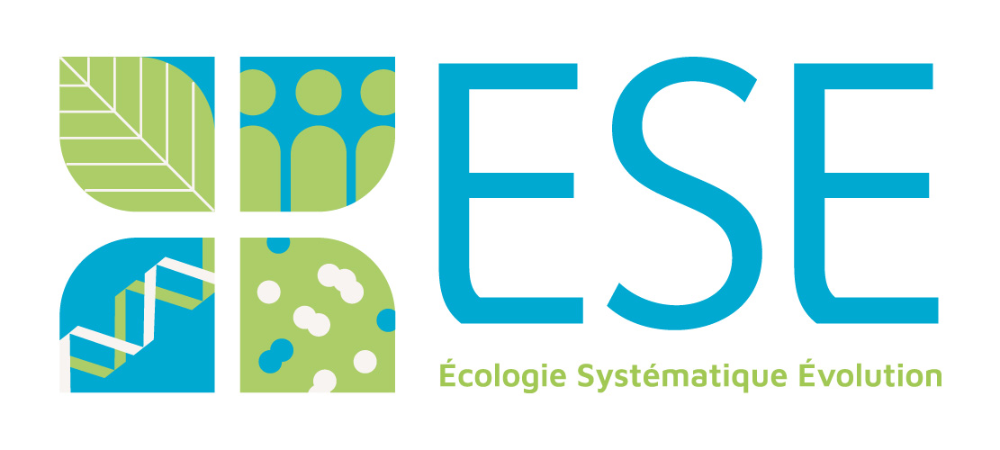
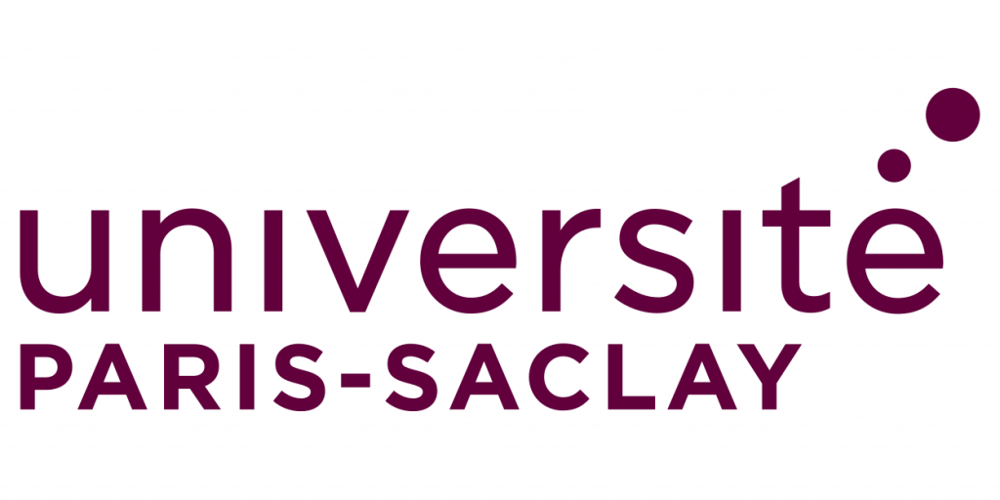

# Quentin Rougemont
[About](#about) · [My work](#my-work) · [Publications](#publications) · [Teaching](#teaching) · [Talks and posters](#talks-and-posters) · [Contact](#contact) · [Scripts and Pipelines](#Scripts and Pipelines)

   
   
   
    
    

## About
Hello,
My name is Quentin Rougemont, and I am a postdoctoral researcher in population genomics. I use the latest methodological advancements in my field to address the following questions:
    1. How do demography, selection, and recombination interact to drive processes of speciation and local adaptation?
    2. How do sex chromosomes evolve and persist across living organisms?
I explore these questions across a wide range of organisms, from fungi and fish to plants and birds, encompassing diverse population sizes and varying degrees of gene flow. To do this, I employ an interdisciplinary approach that requires a solid understanding of fundamental concepts in evolutionary biology. I combine modeling with an empirical approach, leveraging population sequencing, which has enabled me to develop advanced skills in bioinformatics. In an attempt to increase research reproducibility I develop simple workflows for genome assembly, graph analyses, genome annotation, SNP calling, and demographic modelling using ABC and a bit of machine learning. 

Keywords: Evolutionary biology, Speciation, Local adaptation, sex chromosome, genome assembly, genome annotation, GWAS-GEA.

I am currently based at Institute for the Diversity, Ecology and Evolution of the Living World of the Université Paris Saclay ([IDEEV](https://www.ideev.universite-paris-saclay.fr/en/)). 

    
   

## Ongoing work 
I am currently working on the evolution of sex chromosome in *Microbotryum* species my goal is to understand the cause of recombination suppression around sex and mating type chromosome in particular in cases were support for the classical hypothesism of sexual antagonism is low or inexistant.

To this aim I performed whole genome sequencing and annotation of several genome of multiple species of *Microbotryum.*

I quantify rate of genes loss and gains accross dozens of species of Microbotryum to links the rate of loss with the rate of recombination suppression. 

I also use pangenome graph approaches to quantify the landscape of structural variation in these species

I work in Tatiana Giraud's lab ([Evolutionary Genetics and Ecology team](https://www.ideev.universite-paris-saclay.fr/en/equipes/ese-gee/)).

## Past work 

* Mathieu Joron's Lab [CEFE CNRS](https://joron.cefe.cnrs.fr/contact/)

to be filled

## 

* Bernatchez's Lab[Université Laval](http://www2.bio.ulaval.ca/louisbernatchez/presentation_fr.htm), and during my phd:

During my postdoc in Louis'lab as well as during my phd, I focussed mostly in the processes of divergence and speciation within populations. 

During my Ph.D., I was able to combine experimental approaches, population genetics (microsatellite markers), genomics (RADseq), and demographic modeling to better understand the divergence process in parasitic and non-parasitic lamprey ecotypes in Europe.

A unique characteristic of some lamprey and fish populations is their colonization of environments with varying connectivity, ranging from no connectivity in lakes, moderate connectivity in rivers, and very high connectivity in the sea. This variation creates a continuum, where isolated populations experience strong differentiation and genetic drift, little gene flow and display small effective population sizes. 
At the other extreme, populations in highly connected environments exhibit large amount of gene flow and effective population size to maintain nearly zero genetic differentiation across very large geographic scales or even the entire species' range (e.g., eel). This particular context offers the opportunity to address fascinating evolutionary questions about the roles of local selection, demography, and the functional architecture of genomes (e.g., mutation and recombination rates) in shaping genome composition and divergence in these populations.

In isolated lake or river populations, genetic drift promotes the fixation of neutral or moderately deleterious alleles theoretically affecting the entire genome, while selection is expected to act on localized regions in the genome. However, the strong population structure in aquatic environments can make identifying selection challenging. Conversely, in marine populations, the effect of drift is minimal, and theory predicts a low number of adaptive polymorphisms, or that these have a transient contribution to local adaptation, making them similarly difficult to detect. Along this continuum, many factors can confound the effects of local selection, such as background selection, global selective sweeps in structured populations, or the increased frequency of alleles in expanding populations (allele surfing).

In all cases, the genomes of contemporary populations have been shaped by complex demographic histories, which also leave their signatures along the genomes. Finally, the internal functional architecture of genomes, such as variations in the local recombination rate, can generate patterns of differentiation similar to the effects of local adaptation, particularly in regions where recombination is low or absent. 

During this postdoc and my phd I : 
* used and develloped methods to infer the demographic history of populations and deduce the expected neutral differentiation patterns under each demographic model to identify signatures of selection in species living in environments with variable connectivity. 

* Perform Genetic-Environment Association analyes (GEA) which is similar to GWAS approaches to infer putative footprint of local adaptation in various species.

* Used molecular approach to study the genetic load of expanding populations, in particular the process of allele surfing

## Selected Publications

C Moraga*, C Branco*, Q Rougemont*, P Veltsos, P Jedlička, [….], D Charlesworth, T Giraud, A. Bendahmane, A. Di Genova, A. Madoui, R Hobza, G.A.B. Marais The Silene latifolia genome and its giant Y chromosome. bioRxiv 2023.09.21.558754; doi: https://doi.org/10.1101/2023.09.21.558754. In review. [manuscript](docs/34_Moraga_Branco_Rougemont_et_al-2023-InReview.pdf).

Q Rougemont, T Leroy, EB Rondeau, BF Koop, L Bernatchez (2023) Allele surfing causes maladaptation in a Pacific salmon of conservation concern. Plos Genetics  DOI: 10.1371/journal.pgen.1010918. [manuscript](docs/29_Rougemont_et_al_2023_PlosGenetics.pdf)

Y Dorant, M Laporte, Q Rougemont, H Cayuela, R Rochette, L Bernatchez (2022). Landscape genomics of the American lobster (Homarus americanus). Molecular Ecology. https://doi.org/10.1111/mec.16653 [manuscript](docs/23_Dorant_et_al2022MolEcol_Landscape genomics of the American lobster Homarus americanus.pdf)

Q Rougemont, B Huber, S Martin, A Whibley, C Estrada, D Solano, R Orpet, W.O McMillan, B Frérot, M Joron (2023) Subtle introgression footprints at the end of the speciation continuum in a clade of Heliconius butterflies. Molecular Biology and Evolution  https://doi.org/10.1093/molbev/msad166 
[manuscript](docs/28_Rougemont_et_al2023MBE_Heliconius.pdf)

MÁ Rodríguez de Cara*, P Jay*, Q. Rougemont*, M Chouteau, A Whibley, B, F Piron-Prunier, R Rogner Ramos, AVL Freitas, C Salazar, K Lucas Silva-Brandão, T Texeira Torres, M Joron (2023) Supergene formation is associated with a major shift in genome-wide patterns of diversity in a butterfly. Peer-Community Journal (10.24072/pcjournal.298). [manuscript](docs/27_DeCara_Jay_Rougemont_2023_pcjournal_298.pdf)

Q Rougemont, A Xuereb, X Dallaire, JS Moore, E Normandeau, EB Rondeau, RE Withler, DM Van Doornik, PA Crane, KA Naish, JC Garza, TD Beacham, BF Koop, L Bernatchez (2022) Long-distance migration is a major factor driving local adaptation at continental scale in Coho salmon Molecular Ecology https://doi.org/10.1111/mec.16339.
	*  voir perspective: https://doi.org/10.1111/mec.16792 [manuscript](docs/22_Rougemont_Molecular_Ecology_2022.pdf)

Q Rougemont, J-S Moore, T. Leroy, E. Normandeau, E.B. Rondeau, R.E. Withler, D.M.Van Doornik, P.A. Crane, K.A. Naish, J.C Garza, T.D. Beacham, B.F. Koop, L Bernatchez (2020) Demographic history shaped geographical patterns of deleterious mutation load in a broadly distributed Pacific salmon. PLOS Genetics. https://doi.org/10.1371/journal.pgen.1008348 [manuscript](docs/19_Rougemont_et_al2020PlosGen.pdf)

Q Rougemont*, H Cayuela*, M Laporte, C Mérot, E Normandeau, S Jentoft, P Sirois, M. Castonguay, T Jansen, K Praebel, M Clément, L Bernatchez (2020). Shared ancestral polymorphisms and chromosomal rearrangements as potential drivers of local adaptation in a marine fish. Molecular Ecology. https://doi.org/10.1111/mec.15499  (*: Co-first authorship). [manuscript](docs/17_CayuelaRougemont_et_al2020_Shared ancestral polymorphisms and chromosomal rearrangements as potential drivers of.pdf)

C Perrier, Q Rougemont, Charmentier A (2020) Demographic history and genomics of local adaptation in blue tits. Evolutionary Applications. https://doi.org/10.1111/eva.13035 [manuscript](docs/16_PerrierRougemontCharmentier2020_Demographic history and genomics of local adaptation in blue tit populations.pdf)
 

## Teaching 
### Demographic Inference course
> in 2023 I was instructor of the Demographic Inference course online by [physalia](https://www.physalia-courses.org/courses-workshops/demoinference/)

## Scripts and Pipelines 
> all my code can be find [here](https://github.com/quentinRougemont/)

## Talks and posters 
* To be filled

## Contact 
:email: quentinrougemont [at] orange [dot] fr 

---

Last update: 2024/12/03
